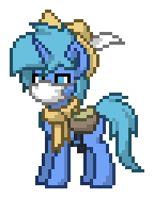

Hi！I am Liu Chenyang(Acbox) 👋

# Who?

I am a middle school student from China, and I like **programming** and **open source**

# About me

* 😀 I am 13 years old and I'm in ninth grade.
* 👀 I am one of the founders of BugDuck open source team.
* 💻 I started learning programming in 2020.

# My second identity

I am a pony from Equestria, This is a country full of friendship, every pony are friendly, this is my photo:

I am a blue pony,and my cute sign is a......is a program bug(🤣)
